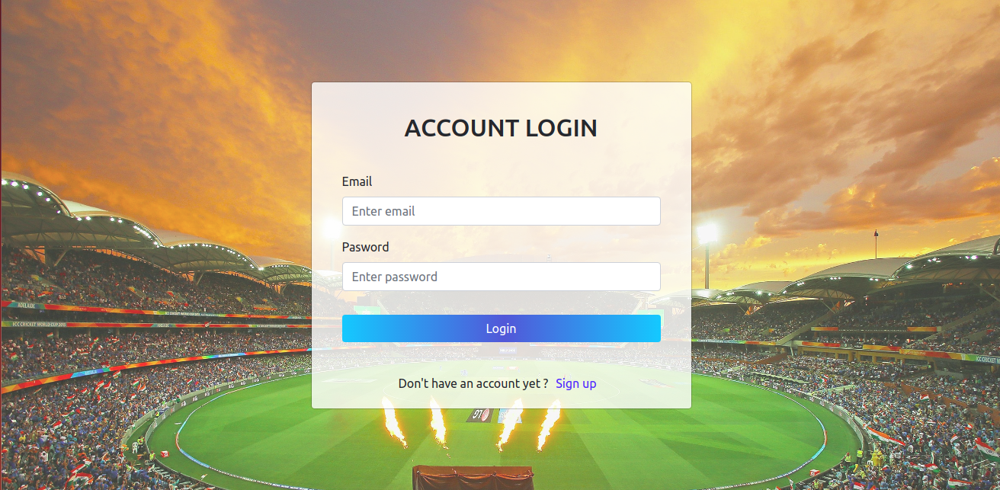
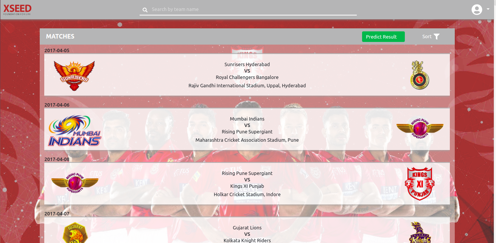
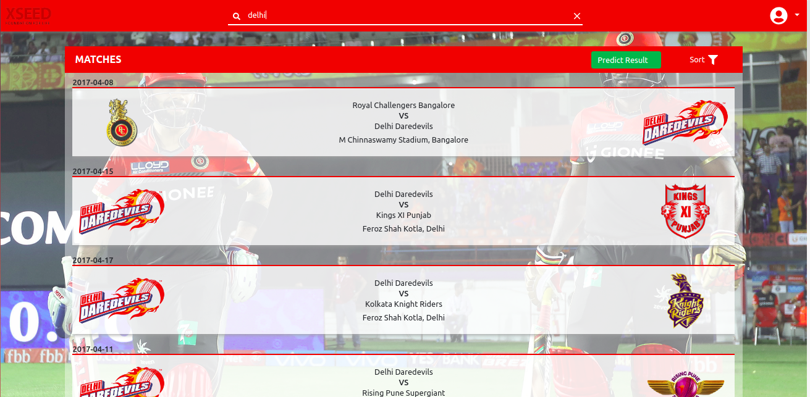
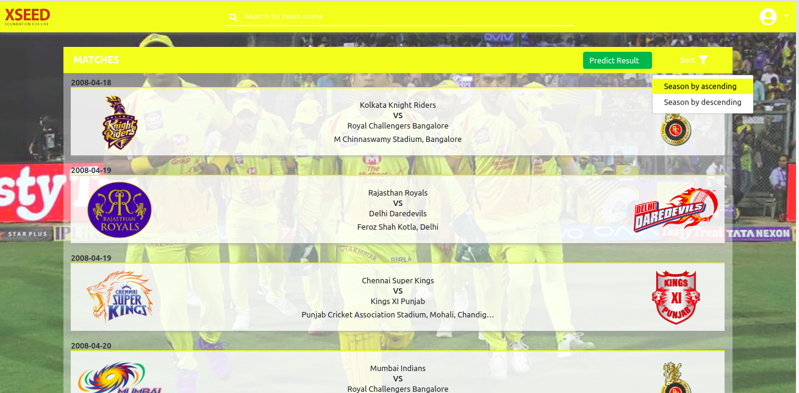
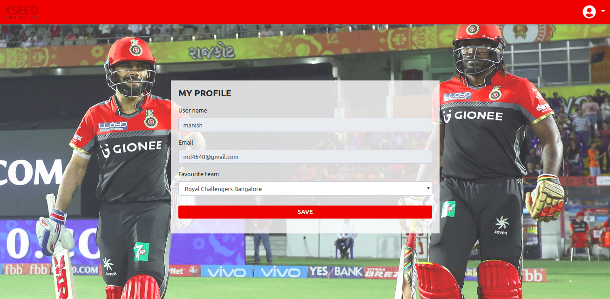

# PREMIER LEAGUE | XSEED FULLSTACK DEVELOPER HIRING CHALLENGE
Develop a pseudo fullstack web app for the Indian Cricket League that lists all the cricket matches that are played between different teams. You are given a CSV le that contains all the match-related data. You are required to create an end-to-end web app in the given tech stack, which lists all the cricket matches provided in the CSV le. On the front-end, show compre-
hensive information about the matches when a user clicks on an item in the list. You are also expected to create the back-end and front-end for this web app. You are given a CSV that contains extensive information about the matches played.

## How to run the project online
Open the online demo [here](https://manish-dalal.github.io/xseed-frontend)

## Features

- Upload the CSV le to the database.
- Write a functional back-end and front-end using the tech stacks mentioned below.
- When a user clicks on a listed item (cricket match), comprehensive info about the
match must be displayed on a separate dedicated page.
- The data sharing between the back-end and the front-end must be in JSON via REST
APIs.
- Writing tests should be a part of the submission.
- Custom design, font, and icons must be used to make the web app more user - friendly.
- Implement sign-up, log in and log out functionalities. You have to create the userauth
schema in the database.
- Implement a functionality that allows users to choose their favourite team. When the
user chooses their favourite team, the color theme of the web app should change to the
color of that team and the team’s logo should appear in the background.
- Implement a functionality in the front-end to search for a team’s matches using the
team name.
- Provide a filter based on the various years (seasons) of the tournament on the front-
end. Choosing a year(s) should show only the matches from those years.
- Implement paging to display the results properly on the front-end.
- Zip all your source code, executables, screenshots and upload the folder.

## GUIDE

- Premier League CSV: http://hck.re/eZsQ4V
- TechStack : MEAN Stack
- back-end: NodeJS-Express
- DB: MongoDB, MySQL
- front-end: React, VueJS

## How to run the project in Development Mode
The project uses [Node.js >= 6.x](https://nodejs.org/en/) and the [Create-React-App starter code](https://github.com/facebookincubator/create-react-app).

After Node is installed in your system, follow the below steps.

1. Navigate to the directory where you want to store the app.
2. Clone the repo `git clone https://github.com/manish-dalal/xseed-frontend.git`
3. Create a .env file in the root directory like the .env.example file.
4. Now install all modules listed as dependencies in `package.json` by running the command `npm install`
5. Launch the app with this command `npm start`

A new browser window open automatically displaying the app.  If it doesn't, navigate to [http://localhost:3000/](http://localhost:3000/) in your browser

***NOTE:*** *The service workers for this app will only cache the site when it is in production mode.*

## How to run the project in Production Mode

1. Build the production ready optimised code. `npm run build`
2. Deploy it to `gh-pages` branch by `npm run deploy`
3. Check the online demo [here](https://manish-dalal.github.io/xseed-frontend)

## Screenshots
Login Page
</img>

Project Home Page
</img>

Search Feature
</img>

Sort season
</img>

Edit profile
</img>
